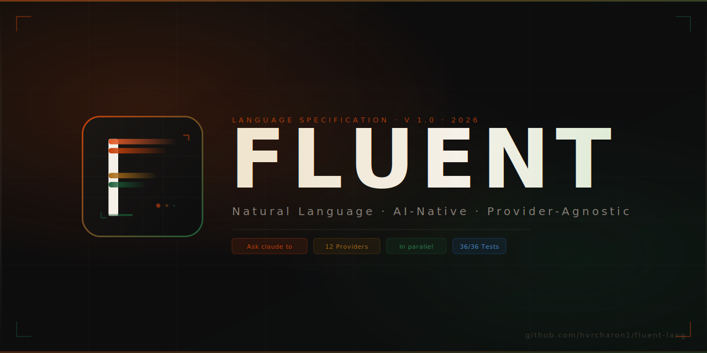

<p align="center">
  
</p>

<p align="center">
  
</p>

# FLUENT — Natural Language AI Programming Language

> *Write AI programs in plain English. Every model, every provider, one sentence away.*

[](https://www.npmjs.com/package/fluent-lang)
[]()
[]()
[]()

---

## Installation

```bash
npm install -g fluent-lang
```

Or run locally from this repository:

```bash
git clone https://github.com/hvrcharon1/fluent-lang.git
cd fluent-lang
npm install
node bin/fluent.js --help
```

---

## CLI Commands

```bash
fluent run program.fl          # Run a Fluent program
fluent test ./tests/           # Run test files (36/36 ✓)
fluent serve api.fl --port 8080  # Expose as HTTP API
fluent estimate program.fl     # Estimate API cost before running
fluent repl                    # Interactive REPL
fluent build program.fl        # Parse and emit .ast.json bundle
fluent env set KEY=value       # Store API credentials securely
fluent env list                # List configured credentials
fluent run program.fl --dry-run        # Validate only, no execution
fluent run program.fl --trace out.json # Write execution trace
fluent estimate program.fl --json      # JSON cost breakdown
fluent test ./tests/ --filter "arithmetic"  # Filter test names
fluent serve api.fl --port 8080 --cors --auth mytoken
```

---

## Quick Syntax Reference

```fluent
-- Declaration
Let name be "Harshal".

-- Model invocation (any provider, one sentence)
Ask claude to "explain this concept" using text my_text and call the result explanation.

-- Fully qualified provider
Ask anthropic/claude-opus-4 to "analyze risks" using document contract and call the result risks.

-- Define a reusable model alias
Define model analyst as anthropic/claude-sonnet-4-6 with temperature 0.1, max_tokens 2000.

-- Conditional
If sentiment is "negative", then ask claude to "draft an apology" and call the result reply.
Otherwise, let reply be "Thank you for your feedback!".

-- For-each loop
For each article in articles:
    Ask gemini to "summarise this" using text article and call the result article_summary.
End loop.

-- Parallel execution
In parallel, for each doc in documents:
    Ask fast_model to "classify" using text doc and call the result doc_category.
End parallel loop.

-- Function definition
To summarise an article (article_text) in (language):
    Ask claude to "summarise in three sentences" using text article_text and call the result s.
    Return s.
End of summarise an article in.

-- Error handling with fallback
Try to ask openai/gpt-4o to "process request" using text input and call the result r.
If that fails, ask claude to "process request" using text input and call the result r.
If that also fails, let r be "Service unavailable.".

-- HTTP API endpoint
@expose(as: http, path: "/classify", method: POST)
To classify message (message):
    Ask claude to "classify as: question, complaint, compliment, or other" using text message and call the result cat.
    Return cat.
End of classify message.
```

---

## Supported Providers

| Provider | Fluent Alias | Default Model |
|----------|-------------|---------------|
| Anthropic | `claude` / `anthropic` | claude-sonnet-4-6 |
| OpenAI | `gpt` / `openai` | gpt-4o |
| Google | `gemini` / `google` | gemini-2.0-flash |
| Mistral | `mistral` | mistral-large-latest |
| Meta / Groq | `llama` / `groq` | llama-3.3-70b-versatile |
| DeepSeek | `deepseek` | deepseek-chat |
| xAI | `grok` | grok-3-mini |
| Perplexity | `perplexity` | sonar-pro |
| Any OpenAI-compatible | custom alias | your model |

Switch providers by changing one word. No code changes required.

---

## Setting API Keys

```bash
fluent env set ANTHROPIC_API_KEY=sk-ant-...
fluent env set OPENAI_API_KEY=sk-...
fluent env set GOOGLE_API_KEY=...
fluent env set GROQ_API_KEY=...
```

Keys are stored encrypted at `~/.fluent/credentials.json` and never appear in `.fl` source files.

> **Without keys:** FLUENT runs in mock mode — all `Ask` statements return a descriptive placeholder. All 36 tests pass with no keys.

---

## Examples

### Hello World
```bash
fluent run examples/hello.fl
```

### Sentiment Analysis Pipeline
```bash
fluent env set ANTHROPIC_API_KEY=sk-ant-...
fluent run examples/sentiment.fl
```

### Multi-Model Pipeline
```bash
fluent run examples/pipeline.fl
```

### HTTP API Server
```bash
fluent serve examples/api.fl --port 8080 --cors
curl -X POST http://localhost:8080/summarize \
  -H "Content-Type: application/json" \
  -d '{"text": "FLUENT is a natural language AI programming language."}'
```

### Cost Estimation
```bash
fluent estimate examples/pipeline.fl
#   Model                                In Tok   Out Tok  Est. Cost
#   ─────────────────────────────────────────────────────────────────
#   anthropic/claude-sonnet-4-6          20       512      $0.007740
#   anthropic/claude-sonnet-4-6          11       512      $0.007713
#   ─────────────────────────────────────────────────────────────────
#   TOTAL                                          1055     $0.015453
```

### Interactive REPL
```bash
fluent repl
fluent› Let x be 42.
fluent› Output x.
42
fluent› Ask claude to "what is 2 + 2?" and call the result answer.
fluent› Output answer.
...
fluent› .vars
fluent› .exit
```

---


---

## File Upload Support

FLUENT natively handles images, audio, video, and documents — both from disk
and via HTTP file uploads. No extra configuration needed.

### Loading Files in Programs

```fluent
-- Load an image from disk
Let photo be load image "report/chart.png".

-- Load a PDF or Word document (text is extracted automatically)
Let contract be read file "contracts/nda.pdf".
Let brief be read file "briefs/q1.docx".

-- Load audio for transcription
Let meeting be load audio "recordings/standup.mp3".

-- Load video (sent to Gemini or other multimodal models)
Let demo be load video "demos/walkthrough.mp4".
Let clip be load video "demo.mp4" sampled at 2 frames per second.
```

### Passing Files to Models

```fluent
-- Image → vision model
Ask claude to "describe everything visible in this chart" using image photo and call the result description.

-- Document → Q&A
Ask claude to "summarise the key obligations in this contract" using document contract and call the result summary.

-- Audio → transcription + analysis
Ask openai/gpt-4o to "transcribe this meeting" using audio meeting and call the result transcript.
Ask claude to "extract action items" using text transcript and call the result actions.

-- Multi-image comparison
Let before be load image "before.png".
Let after be load image "after.png".
Ask openai/gpt-4o to "describe what changed between these screenshots" using images before after and call the result diff.
```

### Supported File Types

| Kind | Extensions | Auto-extraction |
|------|-----------|-----------------|
| Image | jpg jpeg png gif webp bmp svg | Base64 → vision API |
| Audio | mp3 wav ogg flac m4a aac opus | Base64 → audio API |
| Video | mp4 mov avi mkv webm m4v | Base64 → Gemini / video API |
| Document | pdf docx doc txt md csv json xml html | Text extracted automatically |

Install optional extractors for PDF/DOCX:
```bash
npm install pdf-parse mammoth
```

### HTTP File Upload (`fluent serve`)

Every `fluent serve` deployment automatically gets a `/upload` endpoint and
accepts `multipart/form-data` on all routes:

```bash
fluent serve examples/multimodal-api.fl --port 8080 --cors
```

```bash
# Upload an image
curl -X POST http://localhost:8080/analyse-image \
  -F "image=@photo.jpg"

# Upload a document
curl -X POST http://localhost:8080/analyse-document \
  -F "document=@report.pdf"

# Upload audio
curl -X POST http://localhost:8080/transcribe \
  -F "audio=@meeting.mp3"

# Generic upload — runs the full program with the file in scope
curl -X POST http://localhost:8080/upload \
  -F "file=@anything.png"
```

**Accepted field names:** `file`, `files`, `image`, `images`, `audio`,
`video`, `document`, `documents`, `attachment`, `attachments`

**Max upload size:** 50 MB per file (memory-buffered, never written to disk)

## Running Tests

```bash
node bin/fluent.js test ./tests/

  FLUENT Test Runner

  ✓ test_hello.fl › declare and output a string
  ✓ test_hello.fl › arithmetic — addition
  ✓ test_hello.fl › while loop terminates
  ✓ test_hello.fl › for each iterates collection
  ✓ test_pipeline.fl › parallel for-each populates fields
  ✓ test_pipeline.fl › nested conditionals
  ✓ test_types.fl › number comparison operators
  ... (36 total)

  Tests:   36 passed, 0 failed, 36 total
```

---

## Embedding in Node.js

```javascript
const fluent = require('fluent-lang');

const { scope, trace } = await fluent.run(`
  Let topic be "AI safety".
  Ask claude to "summarise in one sentence" using text topic and call the result answer.
  Output answer.
`);

console.log(scope.answer);
console.log(trace.total_cost_usd);
```

---

## Language Specification

| Document | Contents |
|----------|---------|
| [`index.html`](./index.html) | Core spec — syntax, model binding, providers, control flow, pipelines, stdlib, examples |
| [`advanced.html`](./advanced.html) | Advanced — type system, streaming, guardrails, prompt patterns, database, event-driven, security, packages, formal grammar, roadmap |

---

## Repository Structure

```
fluent-lang/
├── bin/fluent.js          CLI entry point
├── src/
│   ├── parser/index.js    NL parser → AST
│   ├── executor/index.js  AST executor
│   ├── providers/index.js 12 AI provider integrations
│   ├── runtime/
│   │   ├── env.js         Credential vault
│   │   └── tracer.js      Execution tracer
│   └── cli/               run · test · serve · estimate · repl
├── examples/              .fl example programs
├── tests/                 .fl test suite (36 tests)
├── index.html             Language spec Part I
├── advanced.html          Language spec Part II
└── .fluentrc              Runtime defaults
```

---

## License

MIT — Datacules LLC, 2026
